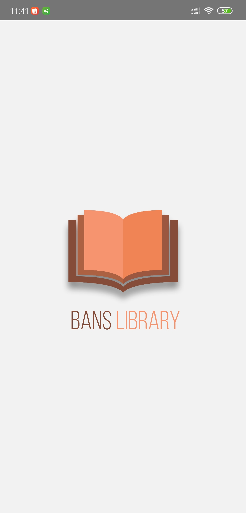

# BansLibrary

  Built with React Native

## Introduction
Sahabat Setia Mobile is library mobile application that can borrow your favorite book, you can search your favotire book in recommendation, category, and all books, you can see detail book, and you can see history of book that being borrowed.

## Features
* Users can see books without login
* Users can borrow book if already logged in
* Users can return book being borrowed
* Users can see history of book that being borrowed or borrowed
* Etc

## Requirements
* [npm](https://www.npmjs.com/get-npm)
* [react-native](https://facebook.github.io/react-native/docs/getting-started)

## Usage for development
1. Open your terminal or command prompt
2. Type `git clone hhttps://github.com/banisholih23/bans-library-reactnative.git`
3. Open the folder and type `npm install` for install dependencies
4. Type `react-native run-android` for run this app.

## Screenshots

    
    
    
    
    
    
    
    
    
    

## Related Project (Backend)
[`Bans-Library-Backend`](https://github.com/banisholih23/bans-library-apps)

## Contributors
[Bani Sholih](https://github.com/banisholih23)
